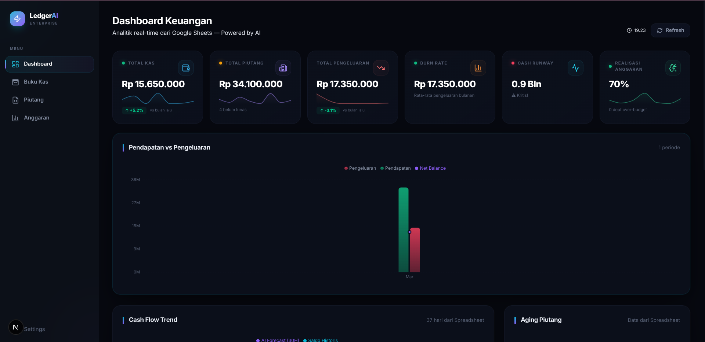
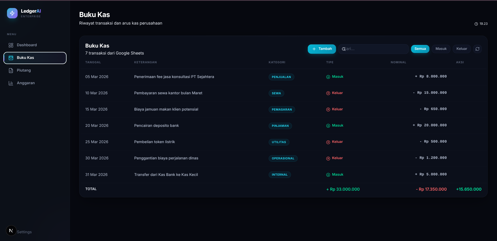
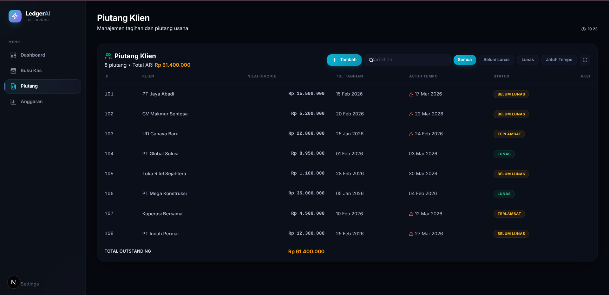
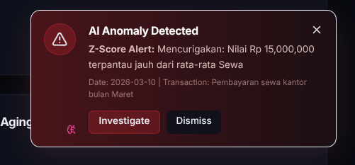

# 📊 Management Finance (LedgerAI Dashboard)

A robust, AI-powered financial dashboard designed to provide real-time analytics, cashflow forecasting, and anomaly detection. This project bridges the simplicity of spreadsheet data entry with enterprise-grade system architecture.


---

## 🎯 Konsep Utama (Core Concept)

Konsep dari **LedgerAI Dashboard** adalah memberikan pengalaman kelas *enterprise* untuk data keuangan yang dikelola sesederhana mungkin (menggunakan Google Sheets). Daripada memaksa user untuk belajar sistem *database* yang rumit, aplikasi ini membaca data langsung dari spreadsheet operasional harian, memprosesnya dengan **Kecerdasan Buatan (AI)**, dan menampilkannya di *dashboard* analitik tingkat tinggi.

Aplikasi ini dibagi menjadi 3 pilar utama:
1.  **Frontend (Next.js):** Fokus pada representasi visual dan metrik bisnis secara *real-time*.
2.  **Proxy Backend (C# ASP.NET):** Fokus pada keamanan, kecepatan (caching), dan menjaga agar data Sheets tidak bisa diakses sembarangan oleh publik.
3.  **AI Engine (Python FastAPI):** Fokus pada analisa matematis (Linear Regression & Isolation Forest) untuk memprediksi keuangan masa depan dan mencari pengeluaran mencurigakan.

---

## 📸 Panduan Halaman & Fitur (Page & Features Guide)

Berikut adalah penjelasan mendalam tentang setiap halaman dan fitur yang ada di dalam aplikasi.

### 1. Main Dashboard Overview


**Penjelasan:**
Halaman utama ini adalah pusat komando (Command Center). Di sini, seluruh data dari berbagai modul dikumpulkan menjadi Key Performance Indicators (KPI).
- **Cash Runway & Burn Rate:** Memberitahu berapa lama perusahaan bisa bertahan dengan saldo kas saat ini jika rata-rata pengeluaran bulanan tetap sama.
- **Realisasi Anggaran:** Menampilkan secara instan apakah persentase penggunaan budget per departemen masih dalam batas wajar.
- **Grafik Revenue vs Expense:** Membandingkan secara visual pemasukan dan pengeluaran dari waktu ke waktu.

### 2. Buku Kas (Transactions)


**Penjelasan:**
Halaman ini adalah representasi mentah dari *cashflow* harian.
- Mengambil data real-time dari tabel *Transaksi_Kas*.
- Semua transaksi keluar masuk tercatat dengan label **Kategori** yang spesifik (misal: "Gaji", "Operasional", "Marketing"). Data kategori ini sangat penting karena akan menjadi sumber analisa "Anomaly Detection" oleh Machine Learning.

### 3. Manajemen Piutang (Accounts Receivable)


**Penjelasan:**
Melacak uang yang belum masuk ke perusahaan (Invoices).
- Menyajikan status tagihan klien (Lunas / Belum Lunas).
- Fitur ini sangat krusial bagi cashflow, karena *Cash Runway* bisa diprediksi salah jika tidak memperhitungkan total uang yang macet di pihak ketiga. Sistem akan men-highlight piutang yang mendekati jatuh tempo.

### 4. AI-Powered Notifications & Anomalies


**Penjelasan:**
Ini adalah asisten pintar (*Smart Assistant*) yang berjalan di *background*.
Menggunakan algoritma **Isolation Forest** via Python, sistem secara berkala memindai ribuan baris transaksi. 
- Jika ada *pattern* aneh (contoh: Pengeluaran "Operasional" biasanya Rp 2.000.000, tiba-tiba ada pengeluaran Rp 25.000.000), sistem langsung menembakkan pop-up alert (*Z-Score Alert*) ke Dashboard untuk segera diinvestigasi.

---

## 🔒 Security & Privacy (Keamanan Tingkat Tinggi)

Arsitektur keamanan aplikasi ini dirancang khusus untuk melindungi data finansial perusahaan:

*   **Zero Client-Side Secrets (Frontend Aman):** Aplikasi *frontend* (React/Next.js) **TIDAK PERNAH** berkomunikasi langsung dengan *database* Google Sheets. Frontend hanya menembak endpoint internal `/api/dashboard`. Ini membuat URL rahasia, token, dan data internal mustahil bisa di-*inspect* oleh sembarang orang via *browser*.
*   **Backend Proxy (C#):** C# ASP.NET berdiri sebagai "Garda Depan". Semua eksekusi *database* (Sheets URL) di-enkapsulasi di dalam memori server backend.
*   **Anti-DDoS (Rate Limiting):** API dilengkapi pembatasan *request* maksimum (`100 request per 10 detik`). Jika batas terlewati, eksekusi akan tertahan, menjaga server dari *spam* dan *traffic overload*.
*   **Caching Strategy:** Sistem menyimpan *cache* data sementara di backend (RAM). Jika ada 1000 user membuka dashboard sekaligus, backend tidak akan menembak Google Sheets 1000x (yang bisa membuat Google memblokir akses karena kuota limit API), melainkan hanya 1x lalu menyebarkan *cache* ke seluruh user.

---

## 🚀 Getting Started (Local Development)

Untuk menjalankan environment ini secara lokal dengan seluruh ekosistem (Frontend, Backend Proxy, dan AI Engine).

### Prerequisites
- Node.js (v18+)
- .NET 8.0 SDK
- Python 3.10+

### 1. Start the C# Backend
C# backend berfungsi sebagai data provider utama di port `5000`.
```bash
cd backend
dotnet run
```

### 2. Start the Python AI Engine
Mesin AI berjalan di port `8080` dan mengambil sampel data operasional dari backend C#.
```bash
cd ai
# Aktifkan virtual environment 
source venv/bin/activate
# Jalankan engine
python main.py
```

### 3. Start the Next.js Frontend
UI interaktif berjalan di port `3000` dan mengkonsumsi API dari proxy C# dan AI Engine.
```bash
cd frontend
npm install
npm run dev
```

Buka `http://localhost:3000` di *web browser* Anda.
